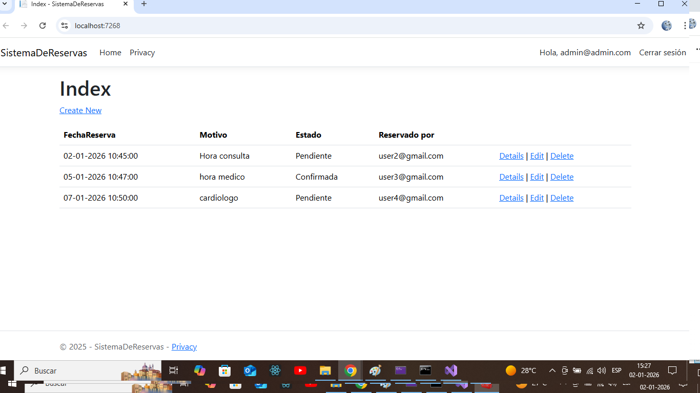
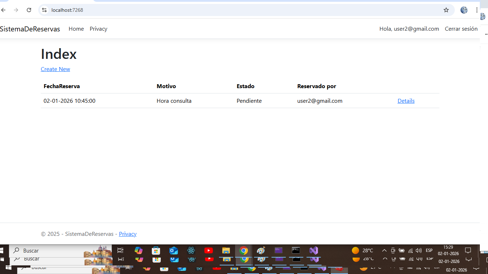

# Sistema de Reservas - ASP.NET Core MVC

Sistema de reservas desarrollado en ASP.NET Core MVC utilizando Identity y Roles.

## Funcionalidades

- Registro y login de usuarios
- Roles: Admin y Usuario
- Cada usuario ve solo sus propias reservas
- El administrador ve todas las reservas
- Asociación automática de reservas al usuario autenticado

## Tecnologías

- ASP.NET Core MVC  
- Entity Framework Core  
- SQL Server Express  
- ASP.NET Identity  

## Capturas

### Vista Administrador

### Vista Usuario

